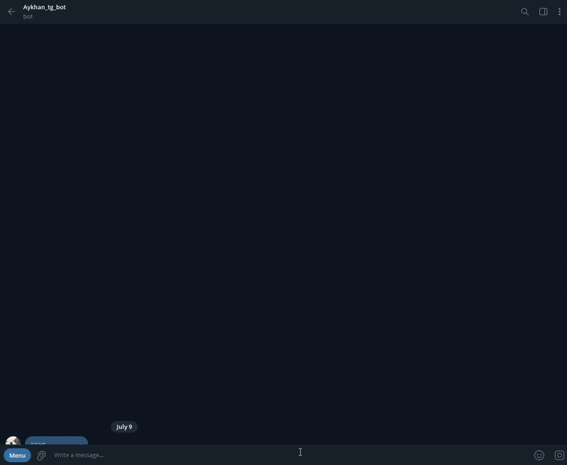

# CarInsuranceBot


[](https://github.com/your-org/CarInsuranceBot/actions)
[](LICENSE.txt)

A Telegram bot that on-boards drivers, OCR-scans vehicle docs, and issues ready-to-sign PDFs for instant car-insurance — built with CQRS and clean-architecture patterns.

---


_Issuing a policy in under 30 seconds_

---

## 📑 Table of Contents
- [🚀 Project Setup](#-project-setup)
- [🗄️ Database Schema](#️-database-schema)
- [🛠️ Sample Configuration](#️-sample-configuration-env--appsettingsjson)
- [🏗️ Project Structure & Design](#️-project-structure--design)
- [⚡ CQRS Structure & Command/Query Flow](#-cqrs-structure--commandquery-flow)
- [🧩 Design Choices](#-design-choices)
- [🧪 Continuous Integration (CI) & Testing](#-continuous-integration-ci--testing)
- [📚 Further Reading](#-further-reading)

---

## 🚀 Project Setup

1. **Clone the repository:**
   ```sh
   git clone https://github.com/your-org/CarInsuranceBot.git
   cd CarInsuranceBot
   ```
2. **Configure environment:**
   - Copy `CarInsuranceBot.Bot/appsettings.json` to your secrets location or use environment variables for sensitive data.
   - Update connection strings, API keys, and blob container names as needed.
3. **Database:**
   - Apply migrations to your SQL Server instance:
     ```sh
     dotnet ef database update --project CarInsuranceBot.Infrastructure
     ```
   - See the schema diagram below for an overview.
4. **Run the bot:**
   ```sh
   dotnet run --project CarInsuranceBot.Bot
   ```

---

## 📝 Available Commands

### **User Commands**
| Command         | Description                                 |
|-----------------|---------------------------------------------|
| `/start`        | Begin or reset the insurance onboarding flow. |
| `/cancel`       | Cancel the current registration/session.      |
| `/retry`        | Retry the document upload or review step.     |
| `/resendpolicy` | Resend the last issued policy document.       |

### **Admin Commands**
| Command           | Description                                                      |
|-------------------|------------------------------------------------------------------|
| `/stats`          | Show summary statistics of issued policies and user activity.    |
| `/faillogs`       | Show logs of failed policy generations.                          |
| `/auditlogs`      | View audit logs of all important state changes and actions.      |
| `/simulateocr`    | Toggle OCR simulation mode and show sample simulated data.       |
| `/adminhelp`      | List all admin commands and their descriptions.                  |

> **Note:** Admin commands are only available to users with admin privileges (as configured in `appsettings.json`).

---

## 🗄️ Database Schema


---

## 🛠️ Sample Configuration (.env / appsettings.json)

```json
{
  "Logging": { ... },
  "Admin": {
    "TelegramAdminIds": [123456789]
  },
  "AzureStorage": {
    "ConnectionString": "<your-azure-blob-connection-string>"
  },
  "BlobContainer": {
    "PolicyContainerName": "policies",
    "FilesContainerName": "passport-registration"
  },
  "Telegram": { "BotToken": "<your-telegram-bot-token>" },
  "Gemini": { "ApiKey": "<your-gemini-api-key>" },
  "Mindee": { "ApiKey": "<your-mindee-api-key>" },
  "MindeeVehiclePassport": { "ModelId": "..." },
  "MindeeDriverRegistration": { "ModelId": "..." },
  "ConnectionStrings": {
    "Default": "<your-sql-connection-string>"
  }
}
```

> **Tip:** Never commit real API keys or secrets. Use environment variables or a secrets manager in production.

---

## 🏗️ Project Structure & Design

- **[CarInsuranceBot.Domain](CarInsuranceBot.Domain/)**: Core business entities, enums, and domain logic.
- **[CarInsuranceBot.Application](CarInsuranceBot.Application/)**: CQRS commands, queries, handlers, interfaces, and business rules.
- **[CarInsuranceBot.Infrastructure](CarInsuranceBot.Infrastructure/)**: Persistence (EF Core), file storage (Azure Blob), external API integrations, and service implementations.
- **[CarInsuranceBot.Bot](CarInsuranceBot.Bot/)**: Telegram bot entrypoint, worker, and message handling.
- **[CarInsuranceBot.Tests](CarInsuranceBot.Tests/)**: Unit and integration tests for all layers.

---

## ⚡ CQRS Structure & Command/Query Flow

- **CQRS** (Command Query Responsibility Segregation) is used throughout:
  - **Commands**: Mutate state (e.g., [`UploadDocumentCommand`](CarInsuranceBot.Application/Commands/Upload/UploadDocumentCommand.cs), [`GeneratePolicyCommand`](CarInsuranceBot.Application/Commands/Policy/GeneratePolicyCommand.cs)).
  - **Queries**: Read state (e.g., [`StatsQuery`](CarInsuranceBot.Application/Queries/Admin/StatsQuery.cs), [`FailLogsQuery`](CarInsuranceBot.Application/Queries/Admin/FailLogsQuery.cs)).
- **Flow Example:**
  1. User sends `/start` or uploads a document in Telegram.
  2. `TelegramBotWorker` dispatches to the appropriate command/query handler via MediatR.
  3. Handlers use repositories/services to read/write data, interact with file storage, or call external APIs.
  4. Responses are formatted and sent back to the user.
- **Admin features** (e.g., `/stats`, `/faillogs`, `/auditlogs`) are implemented as queries with Markdown-safe output.

> **CQRS ensures**: Clean separation of reads/writes, testability, and scalability.

---

## 🧩 Design Choices

- **CQRS** for clear separation of reads/writes and testability.
- **Clean architecture**: Domain, Application, Infrastructure, and Bot layers.
- **Azure Blob Storage**: Separate containers for user uploads and policy PDFs.
- **Audit Logging**: All important actions and state changes are logged for admin review.
- **Markdown Safety**: All Telegram output is escaped to prevent formatting errors.
- **Extensible**: Easy to add new commands, queries, or integrations.

---

## 🧪 Continuous Integration (CI) & Testing

This project uses **Continuous Integration** to automatically build and test all code on every push and pull request.

- **CI Provider:** GitHub Actions (or your chosen CI system)
- **What it does:**
  - Builds the solution
  - Runs all unit and integration tests
  - Fails the build if any test fails

**How to run tests locally:**
```sh
dotnet test
```

**Sample GitHub Actions Workflow:**
```yaml
name: .NET CI
on:
  push:
    branches: [ main, master ]
  pull_request:
    branches: [ main, master ]
jobs:
  build:
    runs-on: ubuntu-latest
    steps:
      - uses: actions/checkout@v3
      - name: Setup .NET
        uses: actions/setup-dotnet@v4
        with:
          dotnet-version: '8.0.x'
      - name: Restore dependencies
        run: dotnet restore CarInsuranceBot.sln
      - name: Build
        run: dotnet build CarInsuranceBot.sln --no-restore --configuration Release
      - name: Test
        run: dotnet test CarInsuranceBot.sln --no-build --configuration Release --logger trx
```

---

## 📚 Further Reading
- See [`Images/Db-Schema.png`](Images/Db-Schema.png) for the full database schema.
- Explore the [`CarInsuranceBot.Application/Commands`](CarInsuranceBot.Application/Commands/) and [`CarInsuranceBot.Application/Queries`](CarInsuranceBot.Application/Queries/) folders for CQRS examples.
- Review [`CarInsuranceBot.Infrastructure/FileStorage`](CarInsuranceBot.Infrastructure/FileStorage/) for blob storage logic.

---

<sub>Made with ❤️ by the CarInsuranceBot team.</sub> 